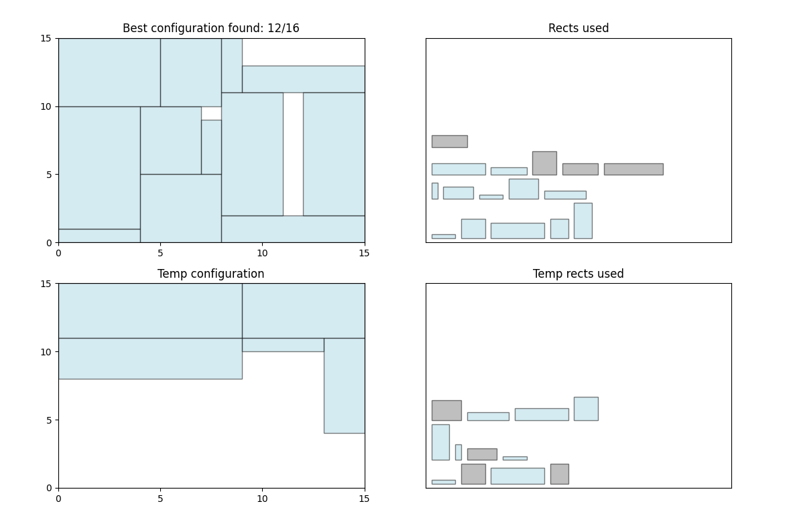

# A* binary packing

The goal of this project is to develop a method for placing rectangular containers inside a warehouse with limited capacity, maximizing the number of containers placed. Each rectangle can be rotated by 90°, but must stay within warehouse boundaries and cannot overlap with others.


We consider the 2D rectangle packing problem: given a set of rectangles with various dimensions and a fixed-size warehouse (width `W`, height `H`, and area `C = W × H`), the objective is to fit as many rectangles as possible without overlapping and within the container bounds.


The problem is solved using a combination of:

* A\* search algorithm
* Two-level rectangle packing strategy

## Run

```shell
pip install -r requirements.txt
apt-get install -y python3-tk
python3 files/main.py
```

Docker
```shell
docker build -t pop .
docker run -it --rm -e DISPLAY=$DISPLAY -v /tmp/.X11-unix:/tmp/.X11-unix pop
```

arg `--plotting` for visualization.

